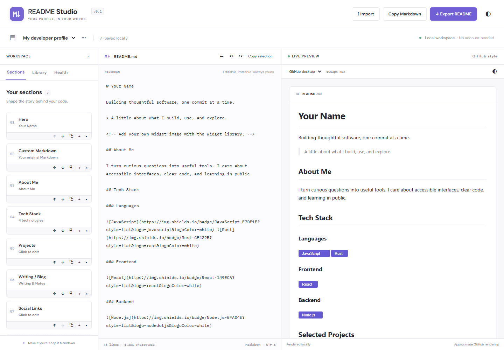

# README Studio

A visual GitHub profile README builder and Markdown studio. Build a profile with editable sections, work directly in Markdown, and export an ordinary `README.md` that works without this app.

**Version 0.1.0** · Native Web Components · Local drafts · Static hosting



## Run locally

Use Node.js **22.12 or newer** and npm.

```sh
npm ci
npm run dev
```

Open the local URL printed by Vite. No credentials, Rust toolchain, backend, or account is required.

## What you can build

- Hero, about, learning, writing, contact, divider, and unrestricted Custom Markdown sections.
- Shields badges and editable badge rows, including light/dark colors and image variants.
- Searchable technology catalog with aliases, custom technologies, categories, badges, code chips, and text lists.
- Social badges, plain links, and centered contact lines.
- Multi-project showcases with compact, detailed, and table-card layouts, screenshots, highlights, status Markdown, and custom links.
- Widget embeds for Constellation, Metrics, Snake, Typing SVG, Streak Stats, GitHub Stats, and Activity Graph. Setup instructions link to the original projects.
- Light/dark `<picture>` markup with alt text, dimensions, links, and alignment.

Choose Minimal, Developer Showcase, Open Source, Student, or Terminal on first launch, import a public GitHub README, or start blank. The sample uses fictional placeholder content. Developer Showcase follows the structural patterns described for [the reference profile](https://github.com/mnichols08/mnichols08), without copying its personal text.

## Editing and drafts

The Markdown editor preserves formatting and supports undo/redo and two-space Tab insertion. **Shift+Tab leaves the editor**, so keyboard users are never trapped. Ctrl/Cmd+Z undoes; Ctrl/Cmd+Shift+Z or Ctrl/Cmd+Y redoes; Ctrl/Cmd+S saves. Alt+1–4 selects Build, Markdown, Preview, or Health on mobile. Section controls provide keyboard reordering, duplication, removal, and copying. The builder can collapse on desktop.

Builder-created documents retain editable block settings. **Editing raw Markdown turns the document into one Custom Markdown block**. This deliberately gives manual text priority: new builder sections append to the preserved text. Undo restores the previous block state. “Split at section headings” explicitly divides raw content into Custom Markdown sections and preserves its exact text; it does not infer structured form fields.

Drafts and theme/preview settings autosave to this browser’s localStorage. Use the menu beside the draft name to rename, duplicate, delete, or create drafts. Download a JSON draft backup to retain builder settings; Markdown export preserves only the portable document. Clearing browser storage removes drafts. Storage failures are reported without silently claiming a successful save.

Import accepts a GitHub username (loads `username/username`) or `owner/repository`. It uses GitHub’s public root README endpoint and default branch. GitHub rate limits, missing repositories, and timeouts produce errors. Local `.md`, `.markdown`, `.txt`, and Studio `.json` imports are supported. Imports open new drafts. No token is requested or stored.

## Preview and health

The preview supports GFM tables, task lists, highlighted fenced code, details/summary, pictures, and a conservative subset of GitHub-compatible HTML. DOMPurify sanitizes generated preview HTML. Links open in a separate tab with `noopener noreferrer`. Preview width presets are maximum widths, constrained by the available pane: desktop (1012), narrow (760), tablet (640), and mobile (375). The separate preview theme toggle simulates light/dark picture sources.

README Health provides advisory Accessibility, Compatibility, Layout, Structure, and **Clutter suggestions**. It reports missing alt text, empty links, heading hierarchy issues, scripts, custom CSS, interactive HTML, large images, wide tables, and excessive badges/widgets. There is no quality score, and checks never delete or rewrite content.

## Security and privacy

Markdown and imported HTML are untrusted. Preview rendering uses an explicit HTML/attribute allowlist and removes scripts, event handlers, unsafe URLs, unsupported interactive content, and custom styles. Raw source and exports remain unchanged, including content flagged by Health. Review warnings before using an export outside GitHub.

Drafts stay on-device; there is no analytics, cloud sync, or server database. Fonts are bundled locally. **Remote images, badges, and widget previews contact their hosting services**, which may receive network information such as your IP address. GitHub import contacts GitHub’s API. Third-party widget setup and availability are managed by their maintainers.

## Architecture

See [docs/architecture.md](docs/architecture.md). Vite builds a small JavaScript application using native Custom Elements and shared CSS. Pure serialization, state, import, parsing, and compatibility modules are separate from the interface. Marked parses GFM, highlight.js highlights code, and DOMPurify sanitizes the result.

**Rust/WASM is intentionally deferred.** JavaScript handles the current document workload without a demonstrated architectural reason to add a second toolchain. Analysis remains a pure module that can later gain a WASM implementation with a JavaScript fallback. No consumer requires Rust.

## Test and build

```sh
npm test
npx playwright install chromium
npm run test:browser
npm run build
npm run preview
```

Unit tests cover serializers, templates, sanitization, warnings, section splitting, document statistics, raw/block ownership, drafts, import errors, Unicode, and 100 KB documents. Playwright covers the showcase acceptance workflow, badges, projects, stack/social/widget/picture builders, themes, preview sizes, raw editing, history, import, storage, export, and mobile layout. GitHub responses and badge images are mocked; tests do not depend on live GitHub.

GitHub Actions runs tests, browser tests, and the production build. It does not deploy.

## Static deployment

`npm run build` creates `dist/`. Serve that directory with any static host.

- **GitHub Pages:** upload the contents of `dist/` using your preferred Pages workflow or publishing branch. Configure Pages separately; CI never publishes automatically.
- **Netlify:** build command `npm run build`, publish directory `dist`. A `netlify.toml` is included.

Vite uses `base: './'`, so built assets work at repository subpaths. There is no application router requiring server rewrites, no server runtime, and no runtime environment configuration.

## v0.1 limitations

- Preview approximates GitHub; it is not pixel-for-pixel parity. GitHub may apply different sanitization and rendering policies.
- Imported relative images/links are preserved and may not resolve locally. Use public absolute image URLs for accurate previews.
- Arbitrary Markdown does not round-trip into specialized forms automatically. Raw editing preserves text as Custom Markdown.
- Health is heuristic, not an exhaustive HTML validator, accessibility audit, or network link checker.
- Local import is limited to 2 MB. The tested editing target is 100 KB; there is no editor virtualization.
- No OAuth, GitHub writes, accounts, AI generation, backend, cloud sync, collaboration, full banner designer, or direct widget-service integration.

## Third-party tools

Badge output uses [Shields.io](https://shields.io). The widget catalog keeps visible links to its upstream projects; README Studio does not copy their code or proxy their services. Dependency licenses are retained in installed packages. See [CHANGELOG.md](CHANGELOG.md) for release notes.
