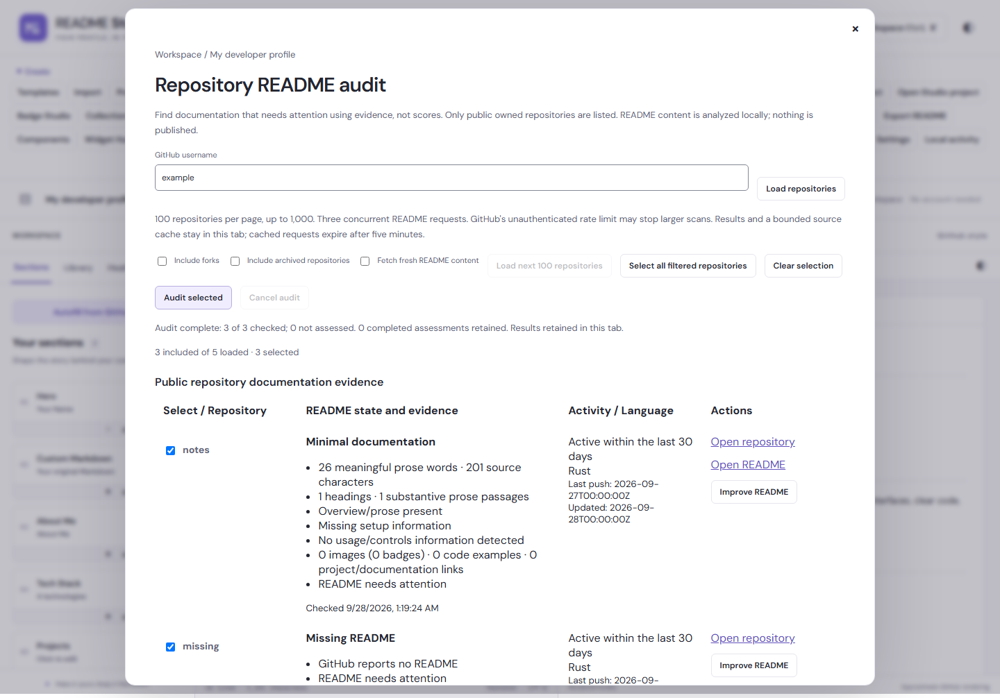

# Repository README auditing

Open **GitHub → README audit**, or search for it with Ctrl/Cmd+K. Enter a GitHub username/profile URL and load public owned repositories. Forks and archived repositories are excluded initially; each can be included explicitly.

Select repositories individually or select all currently filtered repositories, then choose **Audit selected**. Listing repositories does not fetch their READMEs. Results show the README state, primary language, push/update timestamps, archive/activity status and the evidence behind the classification. Results stay in repository-name order; there is no score, percentage, developer ranking or automatic rewrite.

**Open README** and **Open repository** link to GitHub. **Improve README** opens exact fetched source in a new local Custom Markdown draft with repository context. A confirmed missing README opens a blank draft. Your current draft remains available and nothing is published. Use normal editing, Health, refactors and export afterwards.

## Evidence and rules (version 1)

Analysis reuses the existing Markdown analyzer. A leading BOM is ignored for analysis only; original source and byte counts are preserved. Meaningful words count prose rather than headings, images/badge labels, fenced/inline code, comments or executable HTML. A substantive passage has at least 12 words and six distinct words. Images, badges, code examples, non-anchor/non-mailto links and headings are reported separately. Activity is independent of documentation classification.

Rules are evaluated from documentation-heavy down to basic after the stub check:

| State               | Required combination                                                                                                                                                                         |
| ------------------- | -------------------------------------------------------------------------------------------------------------------------------------------------------------------------------------------- |
| Missing             | README endpoint returns 404, or a checked root directory has no README while GitHub exposes a non-root README                                                                                |
| Stub                | Fewer than 20 meaningful prose words or no substantive prose; includes title-only, code-only and badge-only documents                                                                        |
| Minimal             | Substantive prose exists but none of the broader combinations below apply                                                                                                                    |
| Basic               | At least 80 prose words, two substantive passages, plus setup or usage evidence, or two headings and a project/documentation link or non-badge/widget image                                  |
| Detailed            | At least 250 prose words, three headings and three substantive passages, setup and usage evidence, plus a code example, project/documentation link or non-badge/widget image                 |
| Documentation-heavy | At least 1,200 prose words, eight headings and six substantive passages, setup and usage evidence, plus four code examples, four project/documentation links or four non-badge/widget images |

Long text alone cannot qualify as detailed. Empty Setup/Usage headings are not sufficient: their section needs at least six prose words or a nonempty fenced example. English install/setup/requirements and usage/controls/examples terms provide heuristic evidence, including explanatory prose where recognized. These are transparent documentation-coverage rules, not a measure of correctness, project value or developer ability. Other languages and unconventional READMEs may need manual interpretation. A terse library README that links to external docs may be perfectly appropriate despite a minimal classification.

The README endpoint can prefer a file under `.github/` or `docs/`. When that occurs, Studio checks the root Contents listing and reads a root README if present (preferring README.md). If no root README is found, evidence identifies the alternate path. A truncated root listing is **not assessed**, not assumed missing. Deletion/access changes can also produce a 404; results describe the public snapshot, not permanent repository facts.

## Scale, privacy and failure behavior

Load 100 repository records per page, up to 10 pages/1,000 public repositories. The result view renders 25 rows at a time; selection and auditing can span loaded pages. README requests run with at most three concurrent jobs. Analysis runs in a dedicated local Worker with a JavaScript fallback if Workers are unavailable. No remote image previews are loaded by the audit.

GitHub requests go directly to its public REST API with credentials omitted. No sign-in, token input, proxy, repository write or cloud storage is added. Unauthenticated GitHub limits can stop an audit before all 100 or 1,000 selected READMEs are fetched; Studio does not promise to bypass those limits. Rate limits/access denials stop new work, retain completed results and show a retry time when headers permit. In-flight requests may finish. Retry explicitly after the limit resets.

Timeouts, network failures, permissions, oversized/unsupported text and analysis errors remain **Not assessed**, never Missing README. Other repositories continue after ordinary per-repository failures. Cancel or close the dialog to stop scheduling and abort active work. Partial list results remain available if another page fails.

Repository pages and successful/missing README responses are cached in this tab for five minutes. Completed assessments remain for the tab session: subsequent scans retry only failed or unfinished rows, even after the source cache expires. **Fetch fresh README content** explicitly rechecks completed rows too. This allows progress across rate-limit windows without repeatedly fetching the first successful rows. The source cache is limited to about 20 MB of UTF-16 text and 1,000 entries, with oldest entries evicted. Failed reads are not cached. Select **Fetch fresh README content** to bypass successful cache entries. Improving a README may refetch if its source was evicted or expired. Reloading the app clears the session audit. Individual README audits support up to 1 MB of UTF-8 source; larger files can still be opened on GitHub.

API references: [public user repositories](https://docs.github.com/en/rest/repos/repos#list-repositories-for-a-user), [repository README](https://docs.github.com/en/rest/repos/contents#get-a-repository-readme), [Contents](https://docs.github.com/en/rest/repos/contents#get-repository-content). Documentation checked 2026-09-28. The client constructs fixed GitHub API paths and does not follow arbitrary pagination URLs.

## Verification

`tests/repository-audit.test.js` covers deterministic states, meaningful content, archive/fork handling, 1,000-repository pagination, bounded concurrency/cache, missing vs failure, root fallback, partial failures, rate limits, cancellation and malformed responses. `tests/browser/repository-audit.spec.js` covers the 100-repository workflow, session reuse, exact-source new drafts, 320px keyboard controls, cancellation and Worker fallback across Chromium, Firefox and WebKit. Network fixtures are synthetic; tests do not scan a real developer or publish anything.
